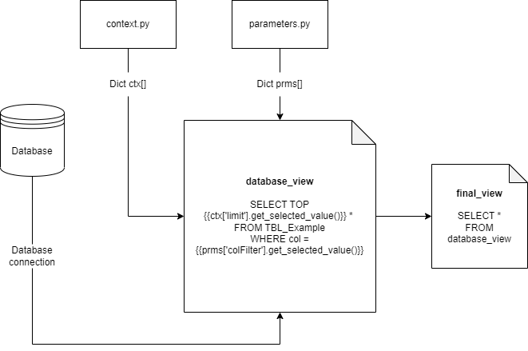

# Create Views with SQL and Jinja

There are two types of views that are relavent to a squirrels project: database views, and final views. The "database view" refers to the view that's directly selected from the database using a connection as described here [Create Views with SQL and Jinja]: ../how-to/database.md, while on the other hand, final view queries from the said database views to genearte the final dataset that is sent to the front end.

## Creating database views 

To create a database view, here are a few simple steps to follow:

1. Create sample file by running the following command in the terminal: `squirrels init --core --db-view sql1` for creating a database view,
`squirrels init --final-view {sql}` for creating a final view. 
 This will create a sample database/final view in the `sample_dataset` folder.
2. Copy over the file from the `sample_dataset` folder to your desired dataset folder, and rename the file accordingly. 
3. Update the file name in `squirrels.yaml` to the name of the file you've just coppied over.
4. Populate the file with the query template for your dataset.

### Creating an empty file and copying (Step 1 - 2)
After you've ran the `squirrels init --core --db-view sql1` command, a `database_view1.sql.j2` file should be generated in the `sample_dataset` folder, or if you ran `squirrels init --final-view {sql}`, you'll get `final_view.sql.j2`. These files can then serve as  templates for the subsequent SQL database views that you'll need to  create for your project. 

After you've created and located the file(s), you can then copy it over to your desired dataset folder, and rename your file(s) accordingly. At this point, your file system should look something like this:

```
<root_project_folder>
...
- \datasets
-- \sample_dataset
--- \database_view1.sql.j2
--- \...
-- \<your_dataset>
--- \<new_database_view_name>.sql.j2
--- \<new_final_view_name>.sql.j2
--- \...
-- \..
```

### Adding the view to squirrels.yaml (Step 3)

After a view has been created, regardless of whether it's using SQL or Python, the views will need to be added to the manifest files in order for the project to be able to see the files. Under `datasets`, construct a field named after the folder the dataset is housed in, and provide the label for the dataset. Under `database_views`, provide each database views' file name, name of the connection under `db_connection`, and any additional arguments {TBA}. Make sure to add the file suffixes.

The datasets field should have at least this much:

```yaml
datasets:
  <your_dataset>:
    label: <your_dataset lable>
    database_views:
      database_view1: 
        file: <new_database_view_name>.sql.j2
        db_connection: default # optional if default
        args: {} # optional if empty
    final_view: <new_final_view_name>.sql.j2
    args: {} # optional if empty
```

### Populating the file (Step 4)
After you've copied over the file as created, you'll see the follwing SQL template for the database view:

```SQL
-- %USE some_db -- TBA: this line is optional when connecting to the "default" db_connection

-- note: if context.py is defined, you can use "ctx['limit']" instead of "prms['number_example'].get_selected_value()"
SELECT dim1, avg(metric1) as metric1, avg(metric2) as metric2
FROM fact_table
WHERE metric1 <= {{ prms['upper_bound'].get_selected_value() }}
GROUP BY dim1
```

If you had created a final view, you should see a select all statement:

```SQL
SELECT *
FROM database_view1
```

In these examples, the database view queries the `fact_table` for the averages of metric1 and metric2 grouping by dim1, while filtering for only those records with metric1 less than or equal to the selected upper bound as provided by the `upper_bound` parameter. 

On the other hand, the final view is what is presented, or, in other words, the view that is sent accross the API to the front end. In this example, it's just a select all statement, but it can be something much more complex spanning multiple database views. If no final view file is provided within a dataset, the default is to return everything from the database view. 

Both of these  views are Jinja templates for SQL, and the standard Jinja syntax applies. The specific SQL syntax is determined by the database as specified in either `connection.py` or `squirrels.yaml`. See [How to create a Database conneciton]:../how-to/database.md for more details regarding database connections and how to create it. 

These views are just examples, feel free to delete them and make your own view from scratch. 

A database view has access to the following keywords:

1. prms
2. ctx
3. proj

The first `prms` variable contains all the parameters as specificed and returned in the `parameters.py` file in the form of a dictionary, where the key is the name of the parameter (the first argument passed into the constructor). Likewise, the `ctx` variable is a dictionary as well consisting of parameter options returned by `context.py`. The `proj` is also a similar dictionary, but contains the project information in the `squirrels.yaml` file. (TODO: Double check this with Tim) As shown in the example above, a parameter can be retrieved in the template like a standard Python map within a double curly bracket `{{}}` by specifying the key like `prms['upper_bound']`, and calling the method format the selected parameters, ie `prms['upper_bound'].get_selected_value()`



In the future, we also plan to add an optional argument analogus to the sql `USE` statement in the sql template in order to have a way to specify which database is to be used. 