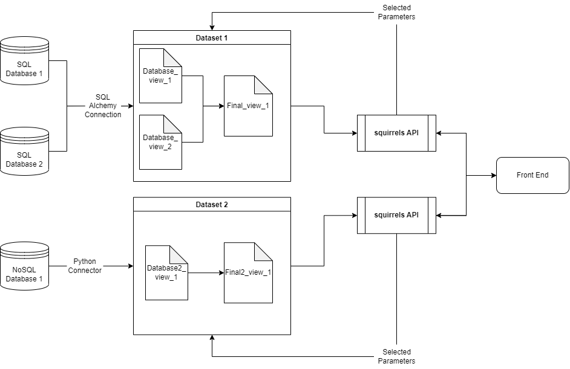

# Overview 

## The Squirrels Framework

Squirrels is a dynamic and flexible framework designed to simplify and automate data analysis tasks for Business Intelligence and data analytics professionals, while easing the burden on data and machine learning engineers. It allows users to generate complex SQL queries dynamically, based on query parameters, and deliver tabular results. The framework is designed to answer evolving business questions and is particularly useful when the volume of data increases over time.

With a primary focus on reusability and flexibility, Squirrels allows for query logic to be stored and shared across multiple applications, thus promoting efficient use of resources and time. The framework makes it possible to create REST APIs that perform calculations, offering parameter values via query parameters and delivering tabular results via the response body.

## Features

### Dynamic Queries with SQL Jinja or Python
Squirrels utilizes Jinja as a templating language for rendering complex SQL queries. These queries are grouped into 'datasets', enabling the dynamic generation of queries based on business needs. Additionally, Squirrels supports Python to generate dynamic queries, providing a more flexible tool for handling NoSQL databases and for executing more complex transformations when needed." 

### API Access to Datasets
Applications can access these datasets and their associated parameters via well-defined API endpoints.

### Cascading Parameters
The framework supports dynamic cascading parameters that adjust based on the selected values. These parameters can be specified within the dataset folder or fetched from database lookup tables.

### In-memory Caching
After the first API call, the framework caches parameter objects in memory, enhancing the performance of subsequent calls.

### Context Variables
Squirrels allows for the creation of "context variables" at runtime, based on selected parameters. These context variables, along with fixed project variables, can be used within templated SQL queries.

### Database and Final Views
Templated SQL queries or Python scripts are rendered to run against one or more databases to generate "database views". These views are then combined to form the final result or "final view". For improved scalability, this operation is performed in the API server's memory. The results are cached based on query parameters for efficiency.

## Framework Workflow

### 1. Initialize Query
When a GET request is made to the base resource path of a project, all available datasets within the project are returned.

### 2. Parameter Retrieval
If a GET request is made to a specific dataset's parameters, all relevant parameter details for that dataset are fetched. This could involve retrieving data from a `parameters.py` file in the project's dataset folder or from database lookup tables.

### 3. Parameter Caching
The first time a dataset API is triggered on a server, the parameters are converted into objects in memory. This process may involve database queries. Once these objects are cached in memory, subsequent API requests will not need to query the database for parameter details again.

### 4. Parameter Setting
For each API request, a copy of the cached parameters is created, and parameter values are assigned from the query parameters. These copies allow for concurrent API requests without risking parameter selection overrides.

### 5. Handling Cascading Parameters
In the event of cascading parameters, the same query parameters as the dataset path are used to handle cascading effects. The default value(s) for the parameter are used if the parameter value is not specified.

### 6. Creating Context Variables (Optional)
Optionally, once parameter selections are finalized, "context variables" are constructed in the `context.py` file. These are Python variables that can be created dynamically at runtime.

### 7. Generating Database Views
Next, templated SQL queries or Python scripts are rendered to create "database views" that are run against one or more databases/data warehouses. The queries can access Python variables for parameter objects, context variables, or project variables.

### 8. Generating the Final View
Finally, a "final view" is created in the API server's memory, which consolidates all the database views to generate the final result for the dataset. The final view is also cached based on the query parameters provided, such that repeated API requests do not require redundant work.
 
Here's an example diagram of how a Squirrels project might be set up:

## Applications

Squirrels' versatility makes it a handy tool for various data analytics scenarios, extending beyond just financial data. It can be used to create APIs for analyzing weather metrics by time period/location, demographics of population segments, or revenue/expenses for various business segments.

In essence, Squirrels is a powerful framework that promotes flexible, reusable, and efficient data analysis and answers evolving business questions, ensuring that your BI and data analysis is always ahead of the curve.